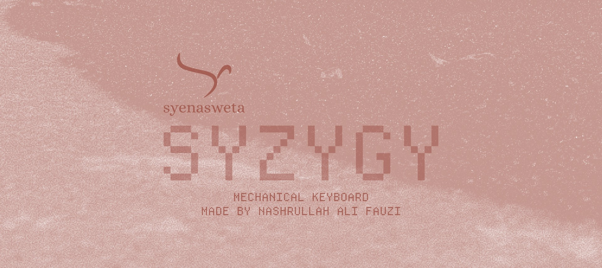
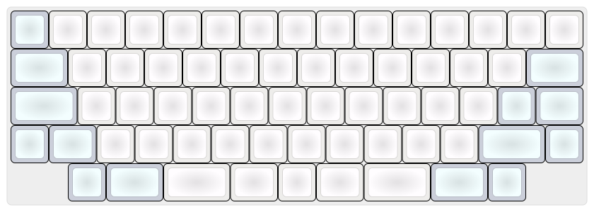
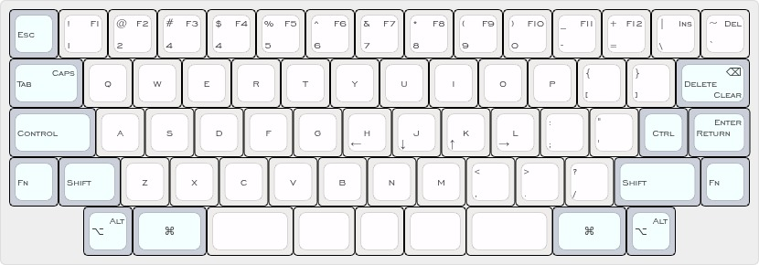

# Syzygy

Syzygy, the mechanical keyboard with sixty six switches, no keycap stabilizer required. Build by Syenasweta a.k.a. Nashrullah Ali Fauzi.

## Keyboard Layout

## Keyboard Feature

Project plan:

- Sound
- Encoders
- Pointing Device
- Joystick
- ...
- ...

## Keyboard Hardware

### Keycaps

- With XDA or DSA profile.

|Size (u)|Qty|
|--------|---|
|1u      |54 |
|1.25u   |4  |
|1.5u    |4  |
|1.75u   |4  |
|Total   |66 |

### Switch

- Cherry MX Black

### Case

- 3D print case and/or sandwich case/wood

#### Sandwich

##### Top

##### Switch

##### Bottom

### Plate

- Aluminum Plate

### PCB

...

### Controller

- RP2040
- Raspberry Pi Pico

## Keyboard Firmware

- QMK
- KMK
- Others