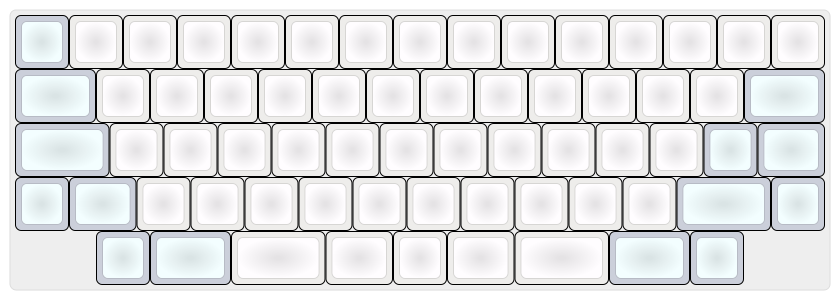
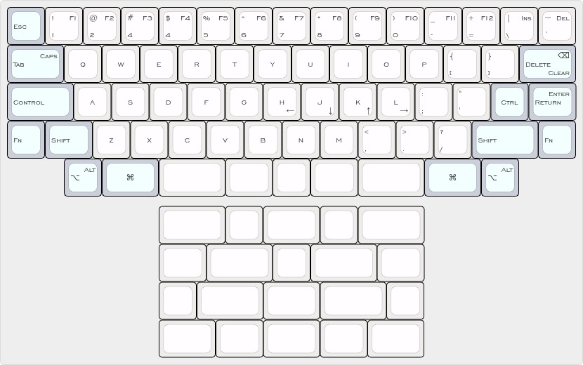

# SYZYGY

Syzygy is mechanical keyboard project by Nashrullah Ali Fauzi.

## Keyboard Layout

## Keyboard Feature

Project plan:

- 66 switches
- No keycap stabilizer required
- Display
- Sound
- Encoders
- LED Indicators

## Keyboard Hardware

### Keycaps

- With XDA or DSA profile.

|Size (u)|Qty|
|--------|---|
|1u      |   |
|1.25u   |   |
|1.5u    |   |
|1.75u   |   |
|Total   |66 |

### Switch

- CHERRY MX BLACK

### Case

- 3D print case and/or sandwich case/wood

#### Sandwich

##### Top

##### Switch

##### Bottom

### Plate

- Aluminum Plate

### PCB

...

### Controller

- RP2040
- Raspberry Pi Pico

## Keyboard Firmware

- QMK
- KMK
- ZMK
- Others

